#  👨‍💻 Prabhat Rana | Frontend Developer Portfolio


<p align="center">
  <strong>Modern React.js Portfolio showcasing projects, skills, and experience in Frontend Development, UI/UX, and Web Development.</strong>
</p>

<p align="center">


</p>

---

## 🌍 Live Preview

> **Live Website**

https://prabhatrana.netlify.app/

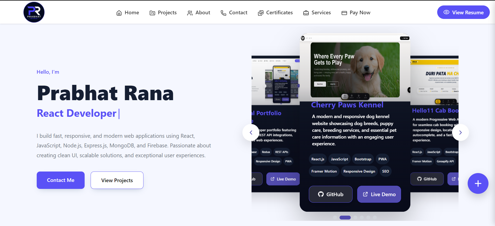

---

# ✨ Overview
Prabhat Portfolio is a modern, responsive, and production-ready frontend application designed to showcase my skills, projects, and experience as a Frontend Developer.

The portfolio is built using React.js with a component-based architecture, clean UI design, and smooth animations to deliver a professional and interactive user experience across all devices.

It focuses on performance, responsiveness, and modern web development practices to present real-world frontend engineering capabilities.

---

# 🎯 Key Highlights

✅ Premium Landing Experience

✅ Progressive Web Application (PWA)

✅ Component-Based Architecture

✅ Responsive Design

✅ Mobile First Approach

✅ Smooth Page Animations

✅ Interactive Booking Modal

✅ Performance Optimized

✅ Modern UI/UX

✅ SEO Friendly Structure

---

# 🖥️ Features

### 🚀 User Experience

* Elegant Hero Section
* Premium Fleet Showcase
* Interactive Booking Form
* Customer Testimonials
* Responsive Image Gallery
* Contact & CTA Sections
* Smooth Scroll Experience
* Premium Hover Effects

---

### ⚡ Performance

* Optimized Asset Loading
* Lazy Friendly Component Structure
* Mobile Optimized Layout
* Fast Rendering
* Lightweight Icon Library
* Installable PWA

---

### 🎨 UI Design

* Premium Typography
* Glassmorphism Effects
* Modern Card Designs
* Responsive Grid Layout
* Smooth Micro Interactions
* Framer Motion Animations

---

# ⚙️ Technology Stack

| Technology             | Usage                                    |
|------------------------|------------------------------------------|
| ⚛️ React.js            | Frontend Development                     |
| 🟨 JavaScript (ES6+)   | Application Logic                        |
| 🎨 Bootstrap 5         | Responsive Grid & UI Components          |
| 💅 CSS3                | Custom Styling & Responsive Design       |
| 🎭 Framer Motion       | Animations & Micro-interactions          |
| 🎯 Lucide React        | Modern SVG Icons                         |
| 🌍 Geoapify API        | Location Autocomplete & Search           |
| 📱 Progressive Web App | Installable Web Application              |
| 🔧 Git & GitHub        | Version Control & Source Management      |

---

<!-- # 🏗 Architecture

```text
src
│
├── assets
├── components
    ├── api
        ├── locationApi.js
    ├── chooseus
        ├── ChooseUs.css
        ├── ChooseUs.jsx
    ├── contact
        ├── Contact.css
        ├── Contact.jsx
    ├── footer
        ├── CommonLinks.css
        ├── Footer.css
        ├── Footer.jsx
        ├── InsurancePolicy.jsx
        ├── PrivacyPolicy.jsx
        ├── RefundPolicy.jsx
        ├── TermsandCond.jsx
    ├── hero
        ├── AnimationCar.css
        ├── AnimationCar.jsx
        ├── Hero.css
        ├── Hero.jsx
    ├── navbar
        ├── BottomNav.css
        ├── BottomNav.jsx
        ├── FloationSocial.css
        ├── FloationSocial.jsx
        ├── Navbar.css
        ├── Navbar.jsx
    ├── ourgarage
        ├── BookingModal.css
        ├── BookingModal.jsx
        ├── OurGarage.css
        ├── OurGarage.jsx
    ├── readytoroll
        ├── ReadytoRoll.css
        ├── ReadytoRoll.jsx
    ├── testimonials
        ├── TestimonialData.js
        ├── Testimonials.css
        ├── Testimonials.jsx
│
├── hooks
    ├── useScrollBottom.js
    ├── useScrollDirection.js
├── pages
    ├── About.css
    ├── About.jsx
    ├── BookingModal.css
    ├── BookingModal.jsx
    ├── CarsData.js
    ├── Gallery.css
    ├── Gallery.jsx
    ├── GalleryData.js
    ├── Home.jsx
    ├── Rent.css
    ├── Rent.jsx
├── routes
    ├── AppRoutes.jsx
├── styles
    ├── variable.css
│    
├── App.jsx
└── main.jsx
├── App.css
└── index.css
```

---

## 🖥️ Desktop Preview

### Homepage
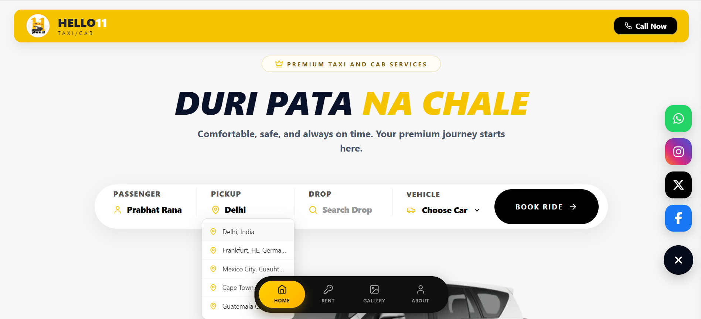

### Premium Fleet


### Our Garage & Why Choose Us
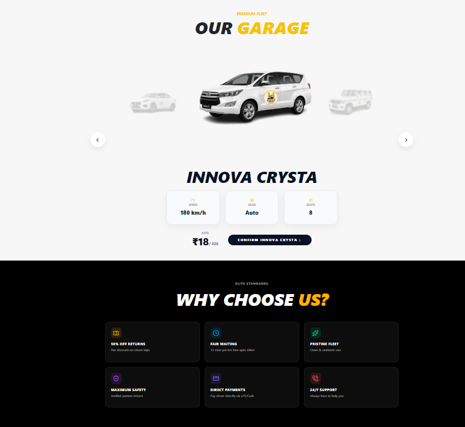
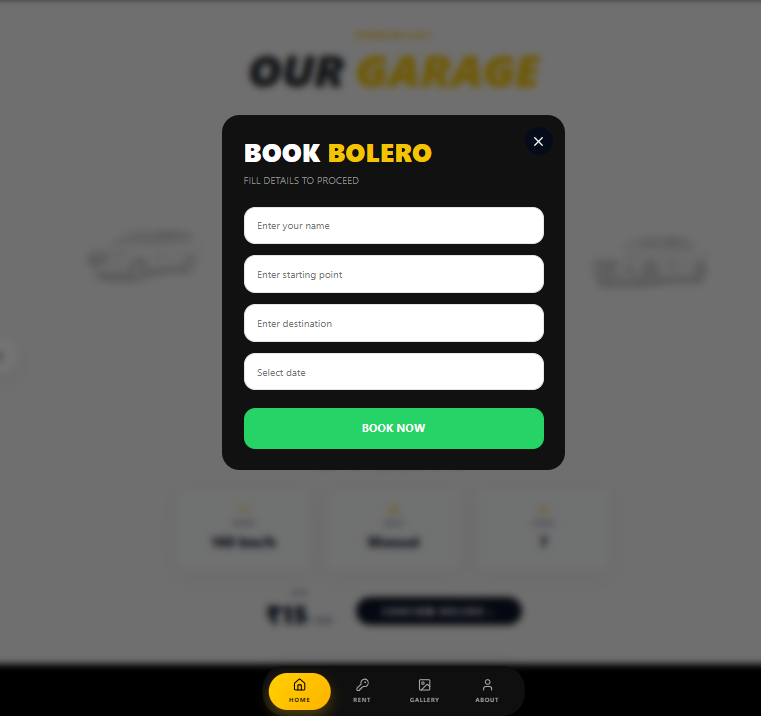

### Feedback Us & Ready To Roll
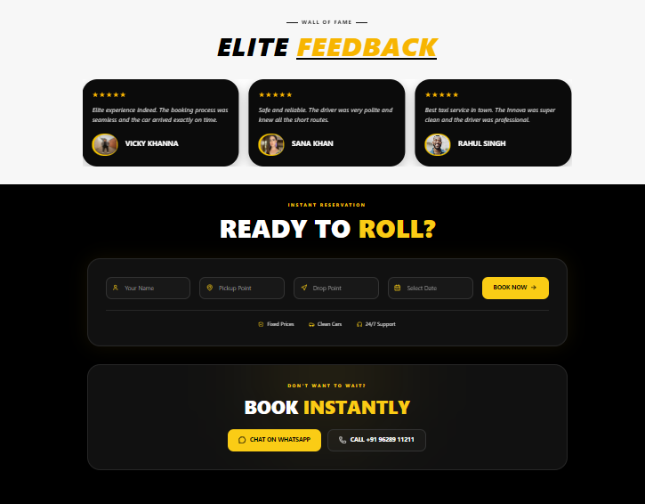

### Footer
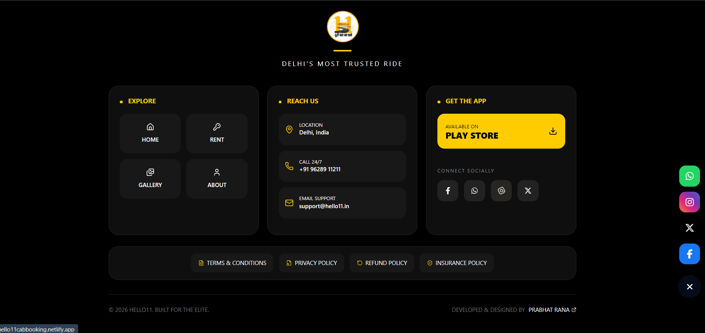

### Rent
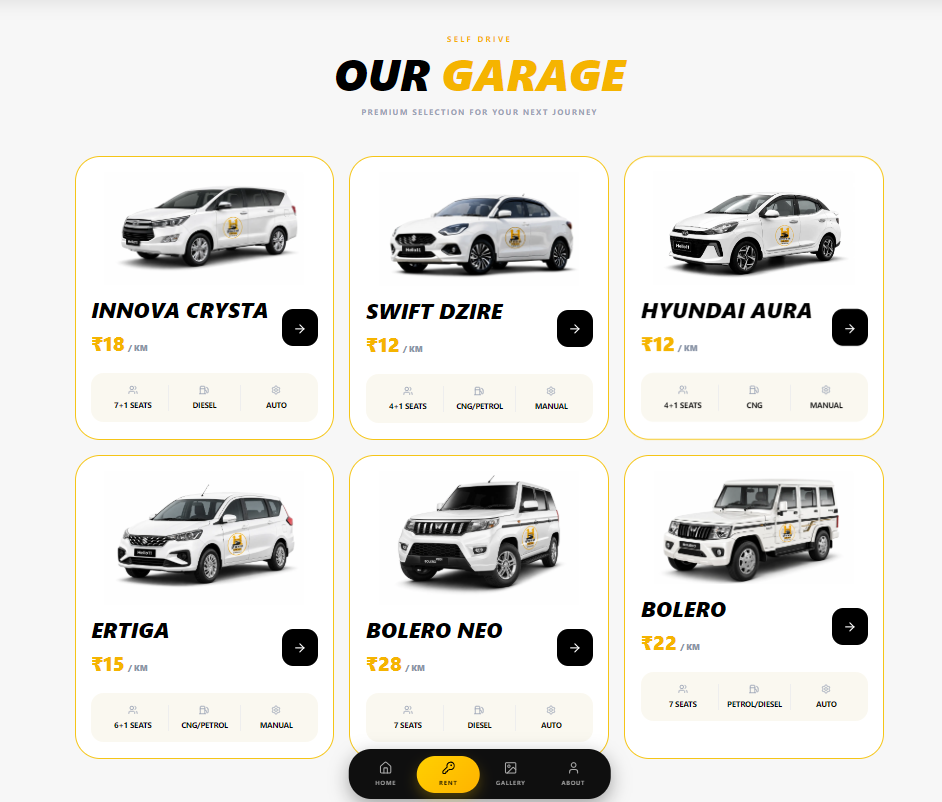
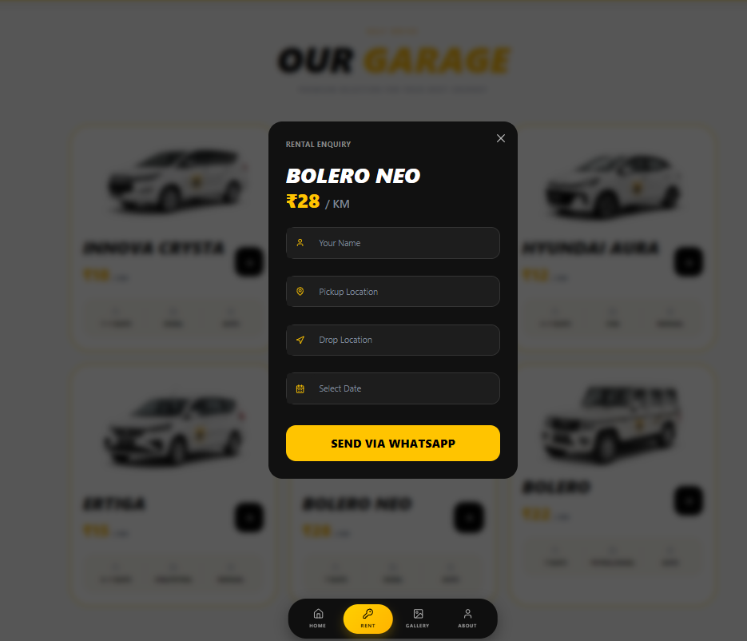

### Gallery
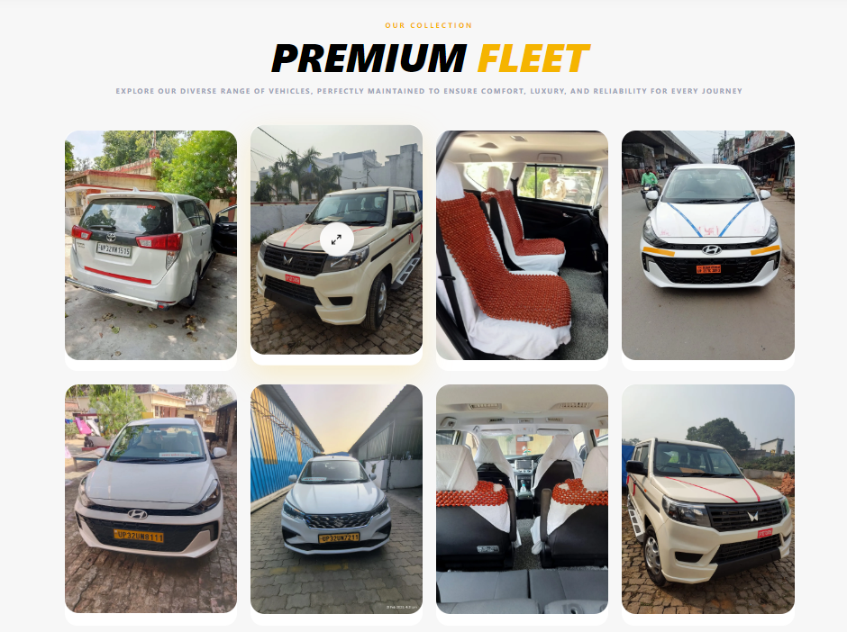
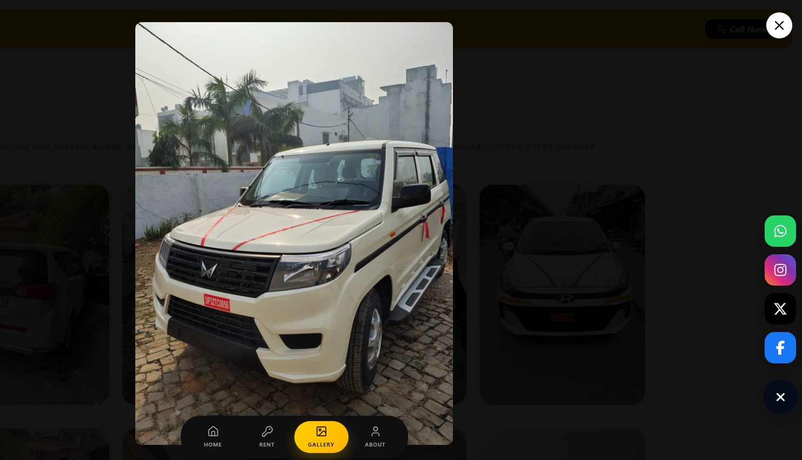


### About Us
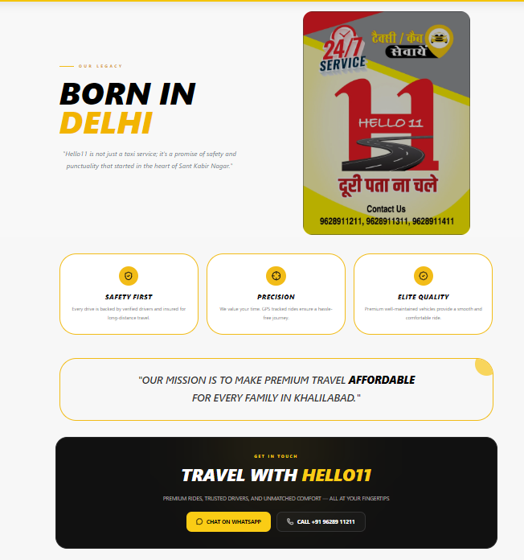

---

## 📱 Mobile Preview

<p align="center">
  
  
</p> -->

# 🚀 Getting Started

```bash
git clone https://github.com/prabhatrana666/prabhat-portfolio.git

cd prabhat-portfolio

npm install

npm run dev
```

Production Build

```bash
npm run build
```

---

# 📈 Performance Goals

* Fast Initial Load
* Responsive Across Devices
* Optimized Rendering
* Smooth Animations
* Accessibility Focused
* SEO Friendly

---


---

# 👨‍💻 Developer

**Prabhat Rana**

Frontend Developer

GitHub → https://github.com/prabhatrana666

LinkedIn → https://linkedin.com/in/prabhat-rana

Portfolio → https://prabhatrana.netlify.app/

---

# ⭐ Support

If you found this project helpful, consider giving it a **Star ⭐**.

It helps others discover the project and motivates future improvements.

---

<p align="center">

Made with ❤️ using React.js by Prabhat Rana

</p>
